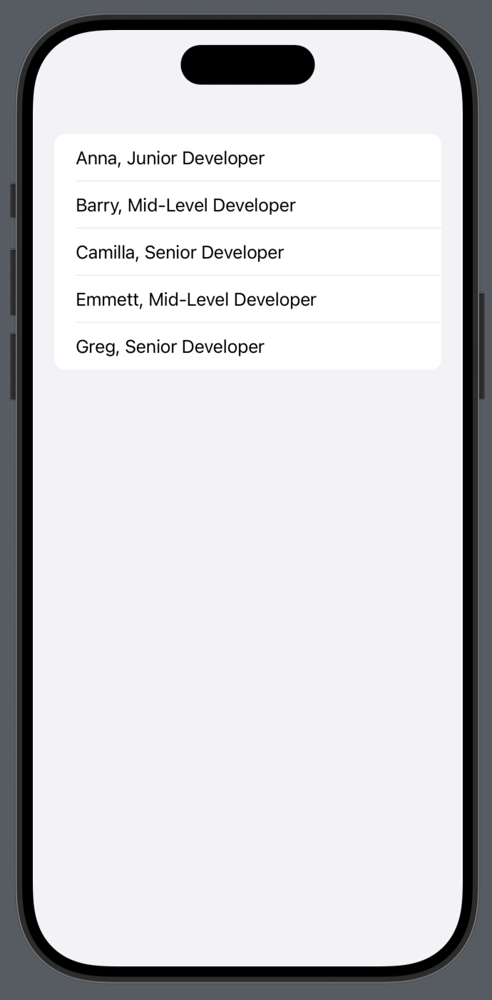

# Coding Challenge: Display Candidates List

## Scenario:
Build a simple SwiftUI app that displays a list of candidates who have applied for a developer position. You are provided with a mock network client (`CandidatesClient`) that fetches a list of candidates asynchronously.

Your goal is to:
1. **Fetch the List of Candidates**: Use the provided network client to fetch the list.
2. **Filter the Data**: Only display candidates who have a certification.
3. **Display the Data**: Show the candidate's name and their experience level in a SwiftUI `List`. Format the experience level as:
   - **junior** -> "Junior Developer"
   - **mid** -> "Mid-Level Developer"
   - **senior** -> "Senior Developer"

## Expected Outcome:
When successful, the list of candidates should display the following rows (based on the mock data):
- Anna, Junior Developer
- Barry, Mid-Level Developer
- Camilla, Senior Developer
- Emmett, Mid-Level Developer
- Greg, Senior Developer

## Files Provided:
- `CandidatesClient.swift`: Contains the mock network client that simulates fetching candidates from a server.
- `CandidateResponse.swift`: Defines the data structure for each candidate, including name, certification, and grade.
- `CandidatesView.swift`: The SwiftUI view where you’ll build the user interface.

## Focus on making the solution clean, efficient, and maintainable
